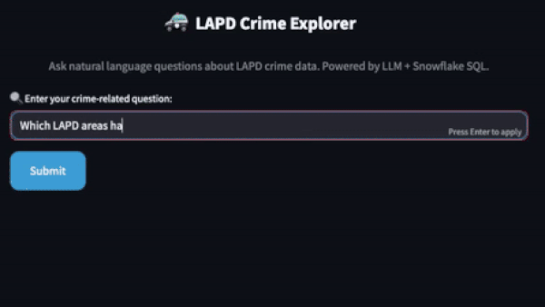

# LAPD Crime Data Pipeline Project

This is a full-stack data pipeline project built as a portfolio to demonstrate end-to-end data engineering and analytics skills using modern tools and best practices. The dataset used includes Los Angeles Police Department (LAPD) crime reports and code mappings. The pipeline processes data from raw ingestion to analytics, reporting, and interactive querying using AI.

---

## 📐 Data Model & ERD

The Snowflake data warehouse uses a star schema centered around the `fact_crime` table. Key design features include:

- Surrogate keys across all dimension tables
- Slowly Changing Dimensions (Type 2) where applicable
- Bridge tables for many-to-many relationships (e.g., crime ↔ MOCODE)

### Entity-Relationship Diagram (ERD)

You can view the full data model:

- [📄 PDF version](docs/lapd_data_model.pdf)
- [💻 dbdiagram.io file](data_model/lapd_star_schema.dbml)

This diagram captures the fact and dimension tables, bridge relationships, and final reporting tables derived via dbt.

---

## 🔧 Project Architecture

```
CSV (Google Cloud Storage)
→ Python (Data Loader: Ingestion + Incremental Load)
→ Snowflake (Raw Tables + Star Schema)
→ dbt (Transformations, SCD2, Incremental Models, Seeds, Tests)
→ dbt docs + Elementary HTML reports stored in GCS
→ Elementary (Data Quality & Testing Observability)
→ Airflow (Orchestration using Astro CLI)
→ Looker (BI Dashboards)
→ Streamlit App (Interactive Q&A powered by SQL Agent + LLM)
→ GitHub Actions (CI for dbt + tests)
```


### 🔍 Highlights

- **📥 Data Ingestion**:
  - Source LAPD CSV file is stored in a **Google Cloud Storage bucket**.
  - Python scripts handle **initial ingestion**, **data validation**, and **incremental loads** into Snowflake.

- **🛠️ dbt Transformations**:
  - Raw tables modeled into staging and transformed into a **Star Schema** (facts/dimensions).
  - Implements:
    - **Incremental models**
    - **SCD Type 2**
    - **Seeded reference data**
    - **Generic & custom dbt tests**
  - **dbt docs** and **Elementary HTML reports** are generated and stored in GCS for traceability.

- **🧪 Data Quality with Elementary**:
  - Tracks and reports on:
    - **Data freshness**
    - **Schema changes**
    - **Anomaly detection**
    - **Test coverage & failures**

- **🧬 Orchestration via Airflow (Astro CLI)**:
  - DAGs orchestrate the full pipeline including ingestion, dbt transformations, and data quality validation.
  - Runs can be scheduled or triggered manually.

- **🧠 Interactive Q&A App with SQL Agent**:
  - Combines a Large Language Model (LLM) with Snowflake SQL to enable **natural language querying** of crime data.
  - The SQL Agent translates questions into optimized SQL queries dynamically executed on Snowflake.
  - Enables real-time data-driven answers on crime trends, victim demographics, weapons, locations, and more.

- **🔁 CI/CD with GitHub Actions**:
  - Automates:
    - dbt runs and tests
    - Data quality validation

- **📊 BI Layer with Looker**:
   - Dashboards built using final reporting tables deliver insights on crime trends and patterns across multiple dimensions.
   - Key reports include:
    - **Crime distribution by area and type**
    - **Victim demographics (age, sex, descent)**
    - **Weapon usage by time of day**
    - **Crime patterns by part of day**
    - **Monthly crime trends by area**
    - **Seasonality of crime types**
    - **LA crime hotspot map (geo visualization)**

---

### 📸 Dashboards & Visualizations

#### Elementary Data Quality Dashboard
You can explore the [Elementary Data Quality Dashboard](https://storage.googleapis.com/lapd-elementary-report/elementary_report.html) to check data freshness, schema changes, and test results.

#### Data Lineage of dbt Models
View the [dbt Data Lineage](https://storage.googleapis.com/lapd-elementary-report/dbt_docs/index.html) to understand how data flows from raw ingestion to the final reporting tables.

#### Looker Dashboard
Explore the [Looker Dashboard](https://lookerstudio.google.com/reporting/caf20ea0-fbae-4b4e-8e96-e3f4805171dd) to interact with crime distribution by area, crime type, and other key metrics.

---

## 🧱 Snowflake Schema Design (Star Schema)

### Dimension Tables

* **dim_area**: Area code and name (25 police reporting districts).
* **dim_crime_code**: Crime codes with detailed descriptions and categories.
* **dim_location**: Geographical location info, including cross streets and coordinates.
* **dim_mocode**: Behavioral patterns associated with the crime (multi-valued, normalized via bridge).
* **dim_premise**: Type of premises where the crime occurred.
* **dim_status**: Disposition/status of the case (e.g., Cleared, Open, Pending).
* **dim_time**: Breakdown of time components (hour, part of day) used for trend analysis.
* **dim_date**: Calendar date dimension supporting time-based reporting and partitioning.
* **dim_victim**: Victim demographics such as gender, descent, and age group.
* **dim_weapon**: Weapon involved in the crime incident.

### Bridge Tables

* **bridge_crime_mocode**: Connects each crime (`dr_no`) to one or more modus operandi codes (many-to-many).
* **bridge_crime_code**: Allows a single crime report to map to multiple crime codes (many-to-many), useful when multiple offenses are involved in a single incident.

### Fact Table

* **fact_crime**: Central grain is one record per crime report (`dr_no`). Links to all dimensions via surrogate keys.

### Reporting Tables (for BI Layer)

* `area_monthly_crime_summary`
* `crime_code_seasonality`
* `location_crime_density`
* `victim_demographics_summary`
* `weapon_type_distribution`

---

## ⚙️ Data Pipeline Components

### Ingestion

* Python script reads LAPD CSV data.
* Uploads to Snowflake using the Snowflake Connector.
* Supports incremental loading and duplicate handling.

### Transformation with dbt

* All raw tables modeled as staging (`stg_*`), then transformed to dimension/fact layers.
* SCD Type 2 implemented for dimension changes (e.g., `dim_location`).
* Incremental load logic applied to fact and some dimensions.
* `seeds/` used for static reference data (e.g., `vict_descent` codes).

### Testing and Observability

* Built-in `dbt tests` for schema and data validation.
* [Elementary](https://docs.elementary-data.com/introduction) used for:
  * Test result lineage and alerts
  * Data freshness
  * Run history & coverage

### Orchestration

* [Astro CLI](https://docs.astronomer.io/astro/cli/overview) used to run DAGs locally.
* Orchestrates Python ingest job, dbt transformations, and tests.

### Reporting with Looker

* Dashboards built using the final reporting tables.
* Use cases include crime hotspots, weapon trends, and victim demographics.

---

## 📊 Sample Use Cases

* What areas in Los Angeles report the highest crime rates?
* How does crime distribution vary by crime type?
* What are the patterns in crime based on victim descent?
* How does crime frequency change throughout the day?
* Are certain age and gender groups more frequently targeted?
* What types of weapons are used during different times of the day?
* Where are the geographic hotspots for criminal activity?
* What are the monthly crime trends in each police reporting area?
* How do different crime types exhibit seasonal patterns?

---

### 🤖 Interactive Q&A App: LAPD Crime Explorer

This project includes an interactive **Streamlit** app powered by a **SQL Agent** that enables natural language querying of LAPD crime data. It combines a large language model (LLM) with Snowflake SQL to generate dynamic answers based on the star schema data warehouse.



> 📽️ *Above: Q&A app answering a sample question in real-time*

### Features

- Ask natural language questions about crime trends, victim demographics, weapons, locations, and more.
- The SQL Agent translates questions into optimized Snowflake SQL queries.
- Provides fast, data-driven answers directly from the warehouse.
- Demonstrates integration of AI, SQL, and data engineering.

### Running the App

To launch the app locally, run:

streamlit run app.py


---

## 🛠️ Tech Stack

| Layer               | Tool/Service                 |
| ------------------- | ---------------------------- |
| Storage & Compute   | Snowflake                    |
| Orchestration       | Apache Airflow (Astro CLI)   |
| Transformation      | dbt Core                     |
| Data Validation     | Elementary Data              |
| Ingestion           | Python + Snowflake Connector |
| Visualization       | Looker                       |
| Interactive Q&A     | Streamlit + SQL Agent + LLM  |
| CI/CD               | GitHub Actions               |

